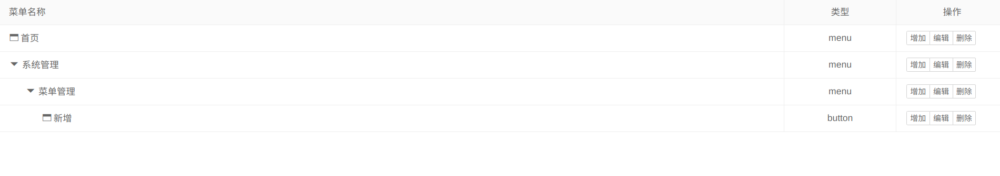

# Tree-Table


### 简介

    基于layui的树形结构表格

### 安装
* 编辑lay-config文件，新增tree-table
```
 layui.extend({
     treeTable:'tree-table/tree',
 });
```

### 使用
```

let data = [
    {
        "id": 1,
        "title": "首页",
        "type":"menu",
        "child": []
    },
    {
        "id": 2,
        "title": "系统管理",
        "type":"menu",
        "child": [
            {
                "id": 3,
                "title": "菜单管理",
                "type":"menu",
                "child": [
                    {
                        "id": 4,
                        "title": "新增",
                        "type":"button",
                        "child": [

                        ]
                    }
                ]
            }
        ]
    }
]

layui.use(['form','treeTable'], function() {
    
    let treeTable = layui.treeTable;

    treeTable.render({
        container : $('#menu-list'), // jquery 对象
        primary : {
            header : {title:'菜单名称',style:''}, //树干头
            field  : 'title' // 树干需要渲染的字段
        },
        extra : { // 扩展列
            headers : [ // 扩展列表头
                {title:'类型',style: 'text-align: center;width: 140px'},
                {title:'操作',style: 'text-align: center;width: 140px'},
            ],
            columns : function (item) { //扩展列 item 指向当前的树节点
                let html = '';

                html += '<td style="text-align: center">'+item.type+'</td>';

                html += '<td>';
                html += '<div class="layui-btn-group">\n';
                html += '<button type="button" class="layui-btn layui-btn-primary layui-btn-xs btn-add">增加</button>\n';
                html += '<button type="button" class="layui-btn layui-btn-primary layui-btn-xs btn-edit">编辑</button>\n';
                html += '<button type="button" class="layui-btn layui-btn-primary layui-btn-xs btn-delete">删除</button>\n';
                html += '</div>' +
                    '</td>';

                return html;
            }

        },
        data : data,
    });


})
```
### 效果


